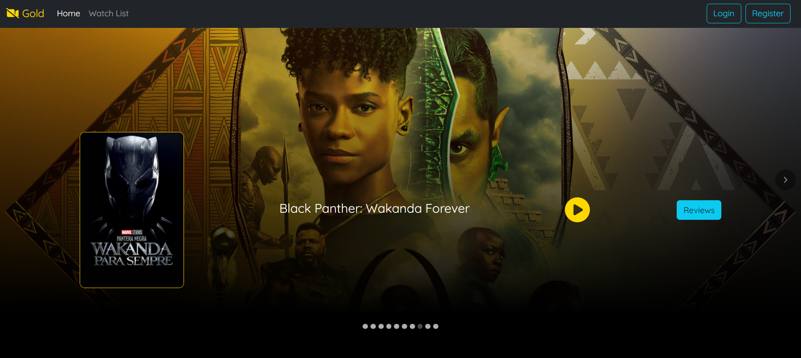

# Movie Review App (Full Stack)
The responsive Movie Review web application is a platform where users can add reviews to movies and watch their trailers. The app enables users to interact with movie reviews, provides an intuitive frontend using React, and ensures efficient data storage and retrieval with MongoDB integrated through Spring Boot.



## 👨‍💻 Built With
* [](https://react.dev/)
* [](https://spring.io/projects/spring-boot)
* [](https://www.mongodb.com/)
* [](https://mui.com/)

## ⚙️ Local Setup and Installation
* Clone this repository.
```
$ git clone https://github.com/aviralj02/movie-review-app.git
```
* Install NPM packages for movie-client.
```
$ cd movie-client
$ npm install
```
* Create a .env file for movie-api and fill up the project details just like [env.example](./movie-api/src/main/resources/.env.example)
* Install packages for movie-api by doing Maven Install in your preferred Java IDE (Eclipse/Idea/STS).
* Spin up the development server for movie-client.
```
$ npm run dev
``` 
